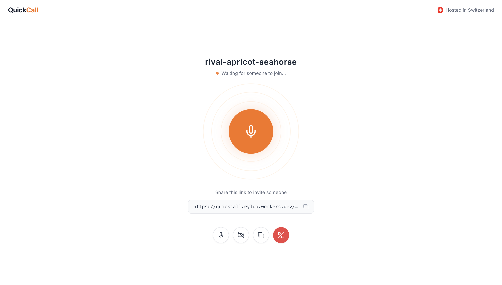

# Telvy — Secure, Private, Peer-to-Peer Calls

> Open-source, end-to-end encrypted audio and video calls in the browser. No signup. No data stored. No third-party services. Self-hosted on your own server.



## Intention

Private communication is under attack. Not by hackers — by governments.

The EU's **Chat Control** proposal would force platforms to scan every private message, even on encrypted services. Signal has threatened to leave the EU entirely rather than comply. In 2025, **Apple pulled end-to-end encryption from the UK** after the government demanded backdoor access under the Investigatory Powers Act. The US reauthorized and **expanded Section 702** (the legal basis for NSA's PRISM program) in 2024. Sweden proposed forcing messaging apps to retain and expose message data. India's traceability law would break encryption by design. Australia already passed laws compelling companies to build interception capabilities.

At the same time, platforms are moving in the opposite direction of privacy. **Discord now requires government ID or face scans** for age verification. Multiple countries are pushing **real-name laws for social media** — China enforces them, the UK's Online Safety Act creates a two-tier system favoring verified identities, and similar proposals surface regularly across the EU and US.

The Five Eyes alliance — the US, UK, Canada, Australia, and New Zealand — continues to coordinate pressure against strong encryption, issuing joint statements calling for "lawful access" to private communications.

Telvy exists because private conversation shouldn't require trusting a corporation, a government, or a third-party server. It's a simple tool: one link, one call, no accounts, no metadata, no trace. The code is open. The encryption is real. The server is yours.

|  | Telvy | Signal | Matrix | Telegram | WhatsApp | Zoom | Meet | Teams | Jitsi |
|---|---|---|---|---|---|---|---|---|---|
| **E2EE default** | ✅ 2 layers | ✅ | ⚠️ opt-in | ⚠️ 1:1 only | ✅ | ❌ | ❌ | ❌ | ❌ |
| **Open source** | ✅ full stack | ✅ full stack | ✅ full stack | ⚠️ client only | ❌ | ❌ | ❌ | ❌ | ✅ full stack |
| **Self-hostable** | ✅ | ❌ | ✅ | ❌ | ❌ | ❌ | ❌ | ❌ | ✅ |
| **No account needed** | ✅ | ❌ phone # | ❌ email | ❌ phone # | ❌ phone # | ❌ email | ❌ Google | ❌ Microsoft | ✅ |
| **No app install** | ✅ browser | ❌ | ⚠️ | ❌ | ❌ | ⚠️ | ✅ browser | ⚠️ | ✅ browser |
| **Server can't see media** | ✅ | ✅ | ⚠️ with E2EE | ⚠️ groups no | ✅ | ❌ | ❌ | ❌ | ❌ SFU decodes |
| **IP hidden from peer** | ✅ forced relay | ✅ | ⚠️ depends | ❌ | ✅ | ✅ | ✅ | ✅ | ✅ |
| **No metadata logging** | ✅ | ⚠️ minimal | ⚠️ depends | ❌ | ❌ | ❌ | ❌ | ❌ | ⚠️ configurable |
| **No third-party services** | ✅ | ❌ Google, AWS | ⚠️ depends | ❌ | ❌ | ❌ | ❌ | ❌ | ❌ Google STUN |
| **Group calls** | ❌ 1:1 only | ✅ 40 | ✅ unlimited | ✅ 1000 | ✅ 32 | ✅ 1000 | ✅ 500 | ✅ 1000 | ✅ 100+ |
| **Your jurisdiction** | ✅ your choice | ❌ US | ✅ your choice | ❌ UAE | ❌ US | ❌ US | ❌ US | ❌ US | ✅ your choice |
| **Simple to deploy** | ✅ ~500 LOC | ❌ | ❌ ~500K LOC | ❌ | ❌ | ❌ | ❌ | ❌ | ❌ ~200K LOC |

## Why Telvy?

Every mainstream calling app — Zoom, Google Meet, Teams, even Jitsi — routes your media through their servers. They see your IP, your call metadata, and often your unencrypted media. Telvy doesn't.

- **E2E encrypted** — Two encryption layers: WebRTC DTLS-SRTP + SFrame (RFC 9605) frame encryption
- **No servers in the media path** — All traffic relayed through your own TURN server (encrypted, unreadable)
- **Zero third-party requests** — No Google STUN, no CDN, no analytics, no external fonts
- **Swiss hosted** — Self-host on a Swiss VPS for strongest privacy jurisdiction
- **No persistence** — No database, no logs, no cookies. Room disappears when you hang up
- **Verification codes** — Both callers see a 6-digit code to confirm no MITM attack

| Feature | Detail |
|---------|--------|
| Encryption | DTLS-SRTP + AES-256-GCM (double layer) |
| IP privacy | Forced TURN relay, peers never learn each other's IP |
| TURN auth | HMAC-SHA1 credentials, 1-hour TTL, rate-limited |
| Signaling | Encrypted WebSocket (AES-256-GCM, HKDF-SHA256 derived key) |
| Forward secrecy | E2EE key ratcheted every 60s via HKDF chain |
| Room PINs | Optional PIN for room auth (never sent to server) |
| Verification | Safety numbers from DTLS fingerprints |
| Persistence | Zero. No database, no logs, no cookies |
| External deps | None. No third-party network requests |
| Jurisdiction | Swiss VPS (not Five Eyes) |

## How It Works

```
You click "Start Call" → get a link like /?room=brave-azure-dolphin
Share the link → other person opens it → call connects automatically
Audio by default. Video optional. One click to end.
```

Under the hood:
1. Native WebRTC with encrypted WebSocket signaling (AES-256-GCM, key derived via HKDF-SHA256 from room ID + optional PIN)
2. Media is forced through your coturn TURN relay (peers never see each other's IP)
3. E2EE key derived from room ID + PIN via HKDF — never exchanged over the wire. Ratcheted every 60s for forward secrecy
4. Safety numbers let both parties verify the connection isn't intercepted

## Quick Start

```bash
git clone https://github.com/user/telvy.git
cd telvy
bun install
bun run dev
```

Open `http://localhost:4321` in two browser tabs. Click the orb. Share the link. Call connects.

## Tech Stack

| Layer | Technology |
|-------|-----------|
| Frontend | Astro 6 (static), Tailwind CSS v4 |
| WebRTC | Native RTCPeerConnection |
| Signaling | WebSocket signaling server (Express + ws, Bun) |
| TURN/STUN | coturn (self-hosted) |
| E2EE | SFrame (RFC 9605) via Encoded Transform API |
| Runtime | Bun |

~500 lines of application code. No frameworks. No build complexity.

## Project Structure

```
src/
  pages/index.astro       Single-page app (all UI states)
  lib/call.ts             WebRTC call logic, encrypted signaling, orb reactivity, controls
  lib/crypto.ts           Verification codes, base64 utils
  lib/e2ee-worker.ts      SFrame (RFC 9605) frame encryption with key ratcheting
  lib/room-id.ts          Word-based room IDs
  styles/global.css       Tailwind theme, orb animations
server/
  index.ts                WebSocket signaling server (ws) + HMAC TURN credentials API
  coturn.conf             coturn configuration template
docs/
  SECURITY.md             Full security model and hardening checklist
```

## Scripts

```bash
bun run dev        # Astro dev (hot reload) + signaling server
bun run build      # Build static site to dist/
bun run start      # Production signaling server only
```

## Production Deployment

One VPS, three services:

```
nginx (443) ──┬── /ws       → signaling server (9000, WebSocket)
              ├── /api/*    → signaling server (9000)
              └── /*        → static files (dist/)

coturn (3478, 5349) ── STUN/TURN relay
```

**Automated setup (recommended):**

```bash
bun run build
sudo bash deploy/setup.sh --domain your.domain.com --email admin@your.domain.com
```

The script installs and configures all services (nginx, coturn, signaling server, TLS, firewall).

**Required firewall ports:**

| Port | Protocol | Purpose |
|------|----------|---------|
| 443 | TCP | HTTPS / WSS |
| 3478 | TCP + UDP | STUN/TURN |
| 5349 | TCP + UDP | TURNS (TLS) |
| 49152–65535 | UDP | TURN relay (media) |

> The relay port range (49152–65535 UDP) is critical — without it, coturn allocates relay candidates but media packets cannot flow.

See [docs/SECURITY.md](docs/SECURITY.md) for the full hardening checklist.

## Limitations

- **1:1 calls only** — P2P architecture doesn't scale to group calls
- **Browser-based** — No native mobile app (works in mobile browsers)
- **Requires TURN server** — Forced relay means your VPS handles all media bandwidth
- **E2EE browser support** — SFrame via Encoded Transform API requires Chrome 110+, Safari 15.4+, Firefox 117+

## License

MIT

---

**Keywords:** WebRTC, peer-to-peer, P2P, encrypted calls, E2EE, end-to-end encryption, private video calls, secure audio calls, self-hosted, open source, no tracking, no logs, Swiss hosting, TURN relay, coturn, Astro, Bun, privacy-first, Signal alternative, Zoom alternative, forward secrecy, encrypted signaling, HKDF
